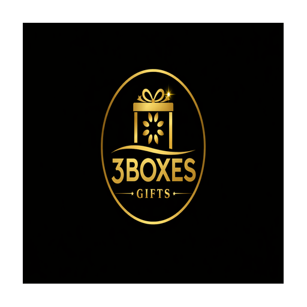

# 3 BOXES LUXURY — Premium Luxury Gifting E-Commerce Platform

<div align="center">



**Curated Luxury Gifting — Watches, Jewelry, Leather, Fragrances & More**

[](https://nextjs.org/)
[](https://flutter.dev/)
[](https://www.typescriptlang.org/)
[](https://www.prisma.io/)
[](LICENSE)

</div>

---

## Overview

**3 BOXES LUXURY** is a full-stack luxury gifting e-commerce platform with a web portal (Next.js) and a cross-platform mobile app (Flutter). It features AI-powered virtual try-on, multi-currency support, corporate gifting, admin dashboard, and PWA install capability.

## Architecture

```
3-boxes-luxury/
├── src/                          # Next.js 16 Web Portal
│   ├── app/                      # App Router pages & API routes
│   │   ├── api/                  # 40+ REST API endpoints
│   │   │   ├── admin/            # Admin management APIs
│   │   │   ├── auth/             # Authentication (login, register, 2FA, OTP)
│   │   │   ├── checkout/         # Order processing
│   │   │   ├── try-on/           # AI virtual try-on
│   │   │   └── ...               # Products, cart, wishlist, orders, etc.
│   │   └── page.tsx              # Main SPA page
│   ├── components/               # React UI components
│   │   ├── ui/                   # shadcn/ui component library
│   │   ├── admin-dashboard.tsx   # Admin management panel
│   │   ├── auth-dialog.tsx       # Login/Register with 2FA
│   │   ├── checkout-view.tsx     # Checkout with gift wrapping
│   │   ├── header.tsx            # Navigation with search
│   │   ├── product-detail.tsx    # Product page + AI try-on
│   │   └── ...                   # 30+ components
│   ├── hooks/                    # Custom React hooks
│   ├── i18n/                     # Internationalization (8 languages)
│   ├── lib/                      # Core utilities & services
│   └── prisma/                   # Database client
├── flutter_app/                  # Flutter Mobile App (iOS & Android)
│   ├── lib/
│   │   ├── config/               # App configuration
│   │   ├── models/               # Data models
│   │   ├── providers/            # State management (Provider)
│   │   ├── screens/              # UI screens
│   │   └── services/             # API service layer
│   └── pubspec.yaml              # Flutter dependencies
├── prisma/
│   └── schema.prisma             # Database schema (30+ models)
├── public/                       # Static assets & product images
├── mini-services/                # Microservices
├── 3_Boxes_Luxury_Technical_Document.pdf  # Technical documentation
└── Caddyfile                     # Reverse proxy configuration
```

## Tech Stack

### Web Portal
| Technology | Purpose |
|------------|---------|
| **Next.js 16** | React framework with App Router |
| **TypeScript 5** | Type-safe development |
| **Tailwind CSS 4** | Utility-first styling |
| **shadcn/ui** | Component library (New York style) |
| **Prisma ORM** | Database with SQLite |
| **Zustand** | Client state management |
| **TanStack Query** | Server state management |
| **Framer Motion** | Animations |
| **ZAI SDK** | AI virtual try-on & image generation |
| **Google Gemini** | AI gift assistant |

### Mobile App
| Technology | Purpose |
|------------|---------|
| **Flutter 3.41** | Cross-platform mobile framework |
| **Provider** | State management |
| **CachedNetworkImage** | Image caching |
| **SharedPreferences** | Local storage |
| **HTTP** | API client |

### Infrastructure
| Technology | Purpose |
|------------|---------|
| **Bun** | Runtime & package manager |
| **Caddy** | Reverse proxy & gateway |
| **SQLite** | Database |

## Features

### E-Commerce
- Product catalog with 57 products across 11 categories
- Advanced search & filtering
- Shopping cart with persistence
- Wishlist management
- Secure checkout with gift wrapping options
- Order tracking with real-time status updates
- Invoice generation

### AI-Powered
- **Virtual Try-On** — Upload a selfie and see how jewelry/watches look on you
- **Gift Assistant** — AI-powered gift recommendations based on occasion & recipient
- **Gift Builder** — Custom gift box creation

### Multi-Currency & i18n
- 10+ currencies with live exchange rates
- 8 languages: English, Hindi, Arabic, French, German, Spanish, Japanese, Chinese
- Auto-detection of user's locale

### Admin Dashboard
- Product, order, user, and category management
- Corporate account management
- Campaign management
- Accounting & financial reports
- Real-time analytics

### Security
- JWT + session-based authentication
- Role-based access control (admin, user, agent, team, corporate)
- Two-factor authentication (2FA)
- SSRF protection on image proxy
- Bcrypt password hashing
- Admin-only route protection via `requireAdmin`

### PWA / Mobile
- Installable on iOS (Safari → Add to Home Screen)
- Installable on Android (Chrome → Install App)
- Offline support with service worker
- Native-like fullscreen experience

## Database Schema

30+ Prisma models including:

```
User → Order → OrderItem → Product
  ↓                    ↓
UserPermission    ProductVariant
  ↓                    ↓
Session           Category ← Product
  ↓
OrderTrackingEvent
  ↓
PaymentSession → OrderInvoice
  ↓
Offer (Coupons)
  ↓
Vendor ← Product
  ↓
Wishlist ← User
  ↓
CartItem ← User
```

## Getting Started

### Prerequisites
- **Bun** runtime
- **Node.js** 20+
- **Flutter** 3.41+ (for mobile app)

### Web Portal Setup

```bash
# Install dependencies
bun install

# Set up database
bun run db:push

# Seed the database
bun run db:seed

# Start development server
bun run dev
```

### Flutter App Setup

```bash
cd flutter_app

# Install dependencies
flutter pub get

# Run on emulator/device
flutter run

# Build for web
flutter build web --release
```

### Environment Variables

Create a `.env.local` file:

```env
JWT_SECRET=your-secret-key
GEMINI_API_KEY=your-gemini-key
```

## API Reference

### Public Endpoints
| Method | Endpoint | Description |
|--------|----------|-------------|
| GET | `/api/categories` | List categories |
| GET | `/api/products` | List products |
| GET | `/api/products/[id]` | Product details |
| POST | `/api/auth/login` | Login |
| POST | `/api/auth/register` | Register |
| POST | `/api/checkout` | Place order |

### Protected Endpoints
| Method | Endpoint | Auth | Description |
|--------|----------|------|-------------|
| GET | `/api/orders` | User | User's orders |
| GET | `/api/cart` | User | Shopping cart |
| POST | `/api/wishlist` | User | Wishlist ops |
| POST | `/api/try-on` | User | AI try-on |

### Admin Endpoints
| Method | Endpoint | Description |
|--------|----------|-------------|
| GET/POST | `/api/admin/products` | Manage products |
| GET/POST | `/api/admin/users` | Manage users |
| GET/POST | `/api/admin/categories` | Manage categories |
| GET/POST | `/api/admin/orders` | Manage orders |
| GET/POST | `/api/admin/campaigns` | Manage campaigns |

## Technical Documentation

A comprehensive 19-page technical document is included:

📄 **[3_Boxes_Luxury_Technical_Document.pdf](./3_Boxes_Luxury_Technical_Document.pdf)**

Covers: Architecture, DB Schema, API Reference, Frontend Components, Flutter App, AI Try-On, Multi-Currency/i18n, Security, Testing Results, Deployment Guide.

## Project Stats

- **1,621** files tracked
- **46** commits
- **246** web source files
- **147** Flutter source files
- **40+** API endpoints
- **30+** database models
- **57** products seeded
- **11** categories

## Auto Git Sync

This repository uses an **automatic Git sync daemon** that monitors all file changes and pushes them to GitHub every 60 seconds. Any updates to code, documentation, or configuration are automatically committed and pushed.

## License

MIT License — See [LICENSE](LICENSE) for details.

---

<div align="center">

**3 BOXES LUXURY CURATIONS** — *Timeless Elegance, Curated for You*

</div>
